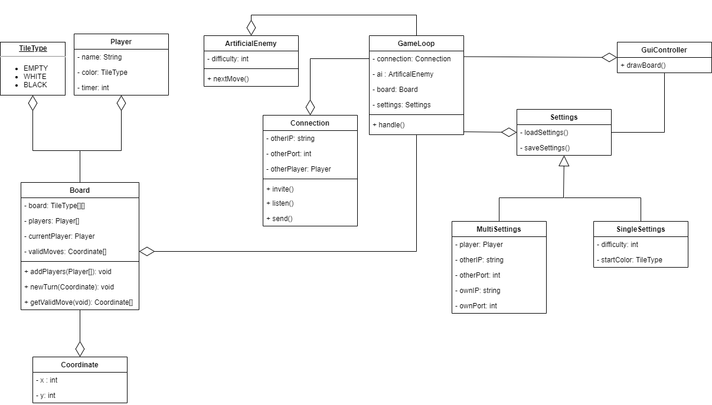

# Tervdokumentáció
## Áttekintés
### Az alkalmazás funkciói
#### Egy- és többjátékos mód
A felhasználó képes a saját számítógépén AI ellen játékot indítani, emellett
helyi hálózaton képes egy másik személy ellen játszani. A hálózati játék
megkezdése előtt meg kell adni egy felhasználónév, IP cím és port kombinációt, amely
segítségével kapcsolódhat a két kliens.

A játékmódot a főmenüben választhatjuk ki, beállítások módosítására külön menüpont van.
#### Többszintű néhézségi szint
A felhasználó az egyszemélyes játékmódban több nehézségi szinten tud a
számítógép ellen játszani. Emellett többjátékos módban lehetőség van maximális
lépésre fordítható idő beállítására, ezzel is finomhangolva a nehézségi
szintet.

### Mentés és betöltés
Egyjátékos módban lehetőség van a játékállás elmentésére és későbbi
betöltésére.  Többjátékos módban a végeredmények elmentésére és ezek
megjelenítésére.

## Felhasználói felület
### Menü
A játék indítása és a beállításai is mind grafikus felületen történnek.

A főmenüben kettő tab lesz, az egyiken belül indíthatjuk el a játékot, a másikon belül pedig a beállítások
módosíthatóak.

A lehetséges beállítások:
- Rendelkezésre álló idő (minden mód esetén)
- Egyszemélyes mód esetén
  + Nehézségi szint választása rádiógombokkal (könnyű, normál, nehéz)
  + A játékos színének kiválasztása (világos, sötét)
- Hálózati játék esetén
  + Név
  + Ellenfél IP címének megadása
  + Saját szín kiválasztása

### Játék közben

A játék megkezdésekor megjelenik a tábla, az egyes korongok a táblán
lévő mezőkre kattintással helyezhetők el. Kiemelésre kerülnek azon
mezők, amelyekre érvényes lépés tehető. Amennyiben a játékosnak nincs
lehetősége érvényes lépésre egy üzenetet kap erről, majd kis idő múlva
ismét az ellenfél következik.

Hálózati játék esetén olyan játékos kaphat meghívást játékra, aki a
főmenüben tartózkodik. Ilyenkor egy felugró ablak értesíti a
kihívásról, amit akkor fogadhat el, ha érvényes felhasználónév van
beállítva.

Egyszemélyes mód esetén mentés és kilépés gomb lesz a felületen, tőbbjátékos mód esetén csak kilépés.
Időzítő beállítása esetén egy visszaszámláló is megjelenik.

## UML osztálydiagram

## Főbb osztályok és feladataik
- GuiController
  - Főmenü megjelenítése
  - Beállítások módosítása
  - Játék elindítása
  - Játéktábla kirajzolása
  - Visszaszámláló megjelenítése

- GameLoop
  - A játék vezérlése
    - Játék elindítása a beállítások alapján
    - Egyjátékos mód esetén fogadja a mesterséges intelligencia válaszait
    - Többjátékos mód esetén feldolgozza a másik játékos lépéseit
    - Kijelzés peridoikus frissítése
- ArtificialEnemy
  - Egyszemélye mód esetén a játéktábla alapján a mesterséges intelligencia következő lépését adja meg
- Connection
  - Felveszi a kapcsolatot a másik játékossal
  - Várja a másik játékos lépéseit
## Használt technológiák
- A grafikus megjelenítéshez JavaFX könyvtár és Scene Builder program használata
- Beállítások módosítására és beolvasására Preferences API
- Hálózati kapcsolat kezelésére a java.net könyvtárat használjuk
## Feladatmegosztás
- Bence
  - Játék logikája
  - Hálózatkezelés
  - Játék mentés és visszaállítás
- Dániel
  - Grafikus felület kialakítása
  - Játékmező interakciójának és megjelenítésének az implementálása
- Viktor
  - Grafikus felület kialakítása
  - Játék vezérlése
  - Mesterséges intelligencia implementálása
